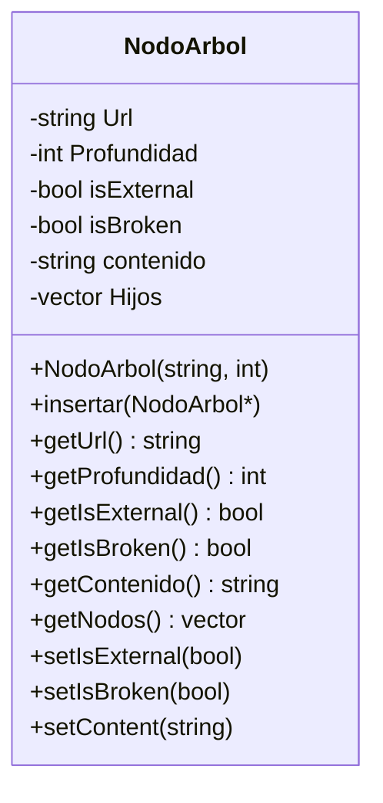
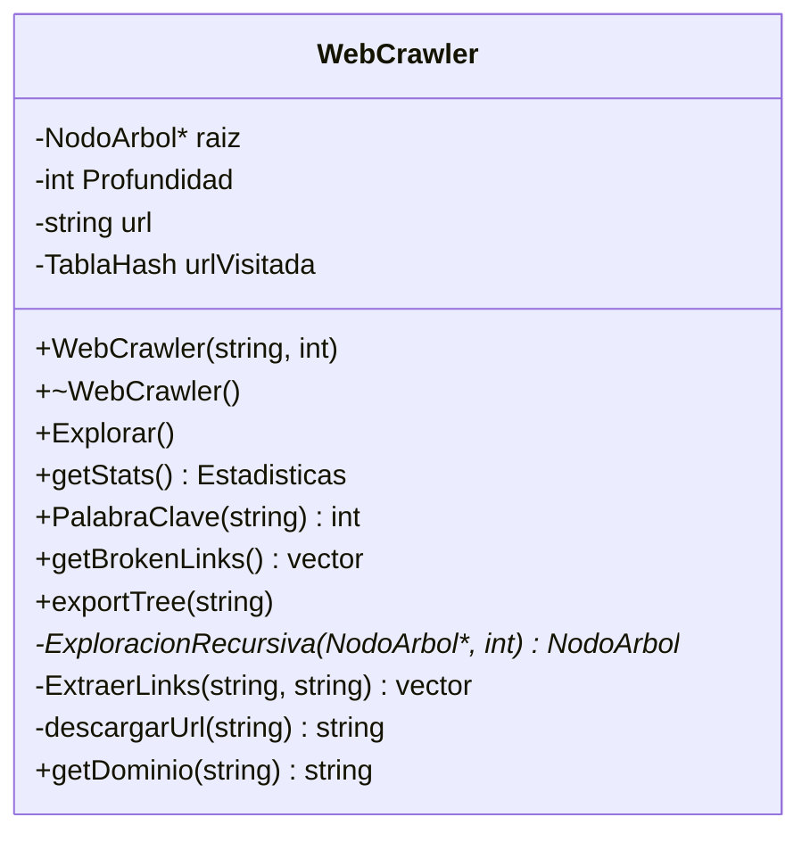
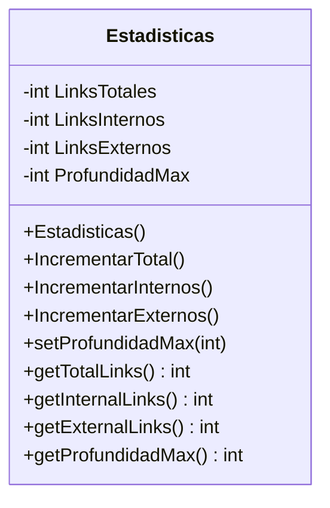
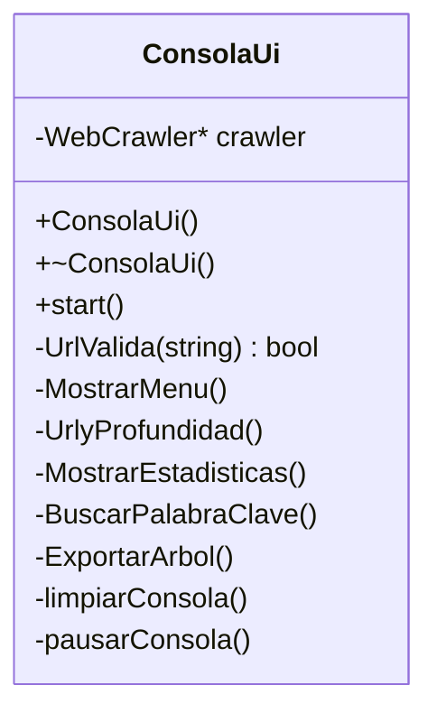
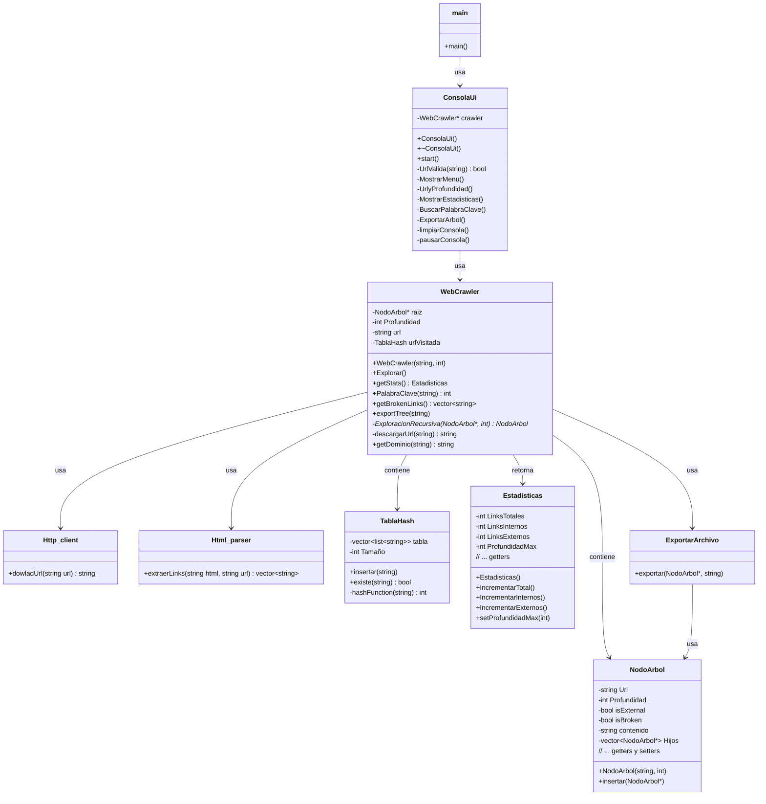
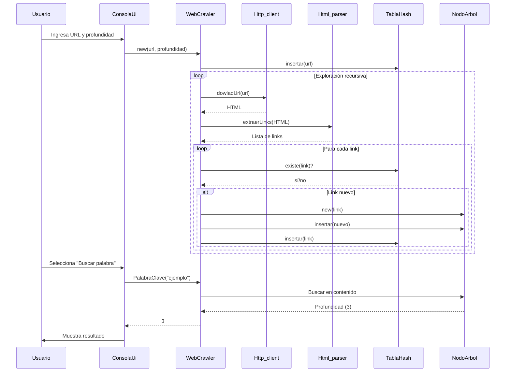

# 🚀 Proyecto WebCrawler

## 👥 Desarrolladores

| Nombre          | Cédula de Identidad |
|-----------------|---------------------|
| **Luis Rojas**  |     30931891        |
| **Daniel Reyna**|     29989066        |
| **Nicole Sereno**|    31275411        |
| **Paola Peña**  |     31152816        |

---

## 📝 Descripción del programa

El programa es un Web Crawler que explora recursivamente sitios web desde una URL inicial hasta una profundidad especificada. Su función principal es:

1-Rastrear enlaces en páginas web.

2-Clasificar enlaces como internos/externos.

3-Detectar enlaces rotos.

4-Generar estadísticas (total de enlaces, profundidad máxima, etc.).

5-Buscar palabras clave en el contenido.

6-Exportar resultados en formato de árbol.

---

## Funciones principales

| Clase | Funcion clave | Descripción |
|-----------------|---------------------|-----------------|
| **WebCrawler** | ExploracionRecursiva() | Rastrea enlaces recursivamente y construye el árbol de navegación. |
| **Http_client** | dowladUrl() | Descarga contenido HTML de una URL usando cURL. |
| **Html_parser** | extraerLinks() | Extrae enlaces de HTML usando regex y convierte URLs relativas a absolutas. |
| **ExportarArchivo** | exportar() | Exporta el árbol de navegación a un archivo de texto con indentación. | 
| **ConsolaUi** | MostrarMenu(), UrlyProfundidad(), MostrarEstadisticas() | Interfaz interactiva para controlar el crawler y mostrar resultados.
 |

## Funcionamiento de la Interfaz de Consola

**Inicio:**

Solicita URL inicial y profundidad máxima.
Valida la URL con regex.

**Menú Principal:**

==================  Menu princial  ==================  
1.- Mostrar estadísticas.  
2.- Buscar palabra clave.  
3.- Exportar árbol.  
4.- Salir.  

**Opciones:**

Estadísticas: Muestra total de enlaces, internos/externos y profundidad máxima.

Buscar palabra: Retorna profundidad donde se encontró la palabra (o -1 si no existe).

Exportar: Guarda el árbol en Busqueda.txt.

## Tablas de Clases

## Diagrama de clases

## Diagrama de secuencia

